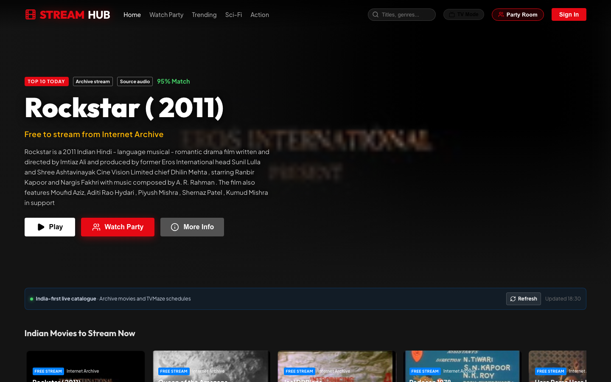
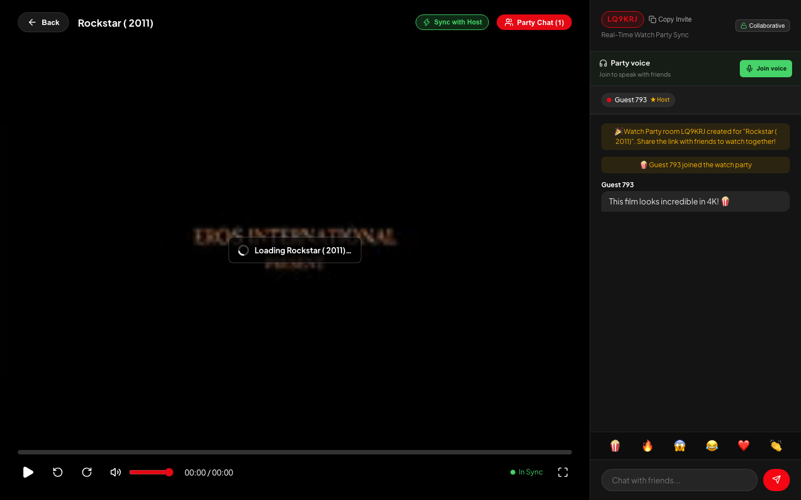
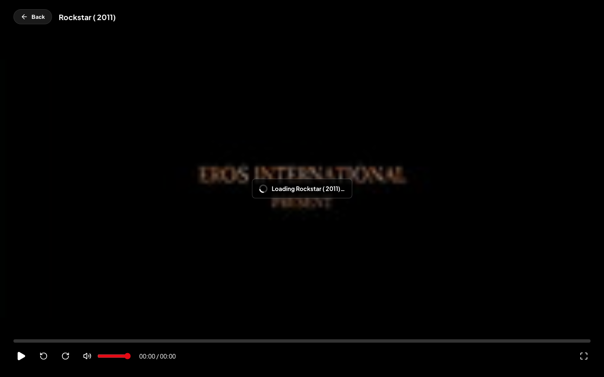
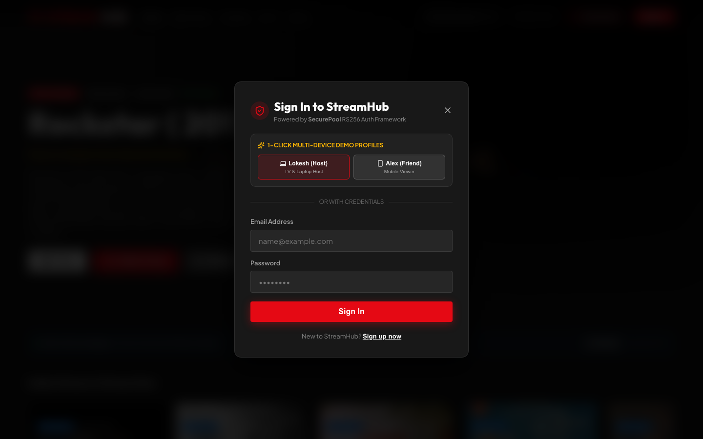
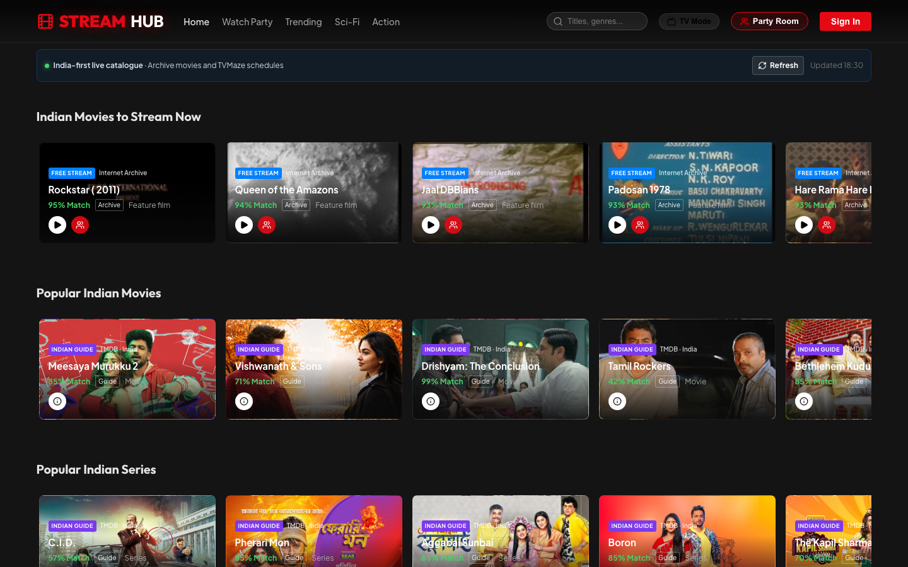
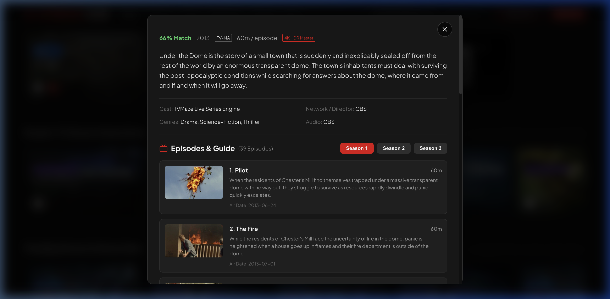
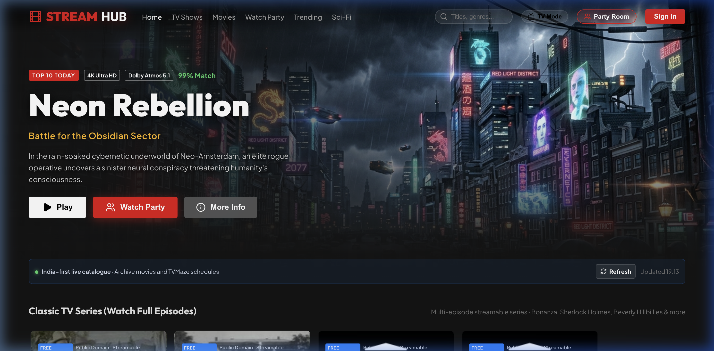
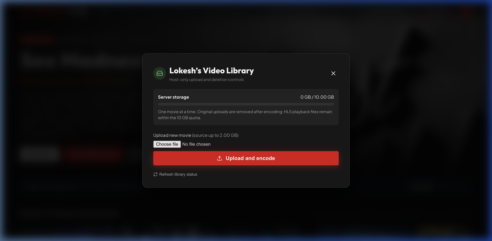

# 🎬 StreamHub — Private Cinema & Multi-Device Watch Party

A next-generation streaming and synchronized watch party platform built with **Next.js 16**, **Node.js Express**, **Socket.io**, and **SecurePool** (`securepool@1.1.3`) authentication. Features an ultra-responsive Netflix-inspired dark aesthetic, HTTP 206 Partial Content Range video streaming, live cross-device watch history, and real-time synchronized playback rooms with chat and emoji reactions.

Integrated with the **Internet Archive Open Movies API** for streaming free feature films and public domain classics with complete metadata.

> 📖 **Developer & AI Prompt Blueprint**: Looking to extend this project to full enterprise production? See [DEVELOPMENT_PROMPT.md](DEVELOPMENT_PROMPT.md) for the complete 7-phase architecture blueprint with copy-paste AI prompts for HLS transcoding, WebRTC voice chat, Smart TV D-Pad navigation, TMDB auto-ingestion, and Oracle VPS Docker deployment.

---

## 🌟 Key Features

- **Netflix-Grade Cinematic UI**:
  - Hero featured banner with 4K HDR badges, Dolby Atmos tags, match scores, and direct action triggers.
  - Horizontal scrolling category tracks with smooth card hover scaling, synopsis preview, and metadata badges.
  - Smart TV Remote D-Pad Navigation mode with enlarged focus indicators.
- **Ultra-Low Latency Video Streaming Engine**:
  - Implements **HTTP 206 Partial Content** byte-range requests for instant scrubbing and zero-lag playback on Smart TV, Laptop, and Mobile browsers.
  - Uploads MP4, MKV, MOV, M4V, and WebM into source-aware adaptive HLS (`.m3u8`) ladders at 360p, 720p, 1080p, and genuine 4K/2160p when the uploaded source supports it.
  - Produces a preview clip, subtitle and chapter VTT files, plus a storyboard sprite for scrub-hover previews.
  - Uses hls.js for adaptive browser playback, manual quality selection, and available audio/subtitle tracks.
- **Mobile Watch Party & PWA**:
  - On phones, the movie remains the primary screen. Party Chat opens as a full-screen lounge with voice controls and a **Back to video** button.
  - Includes an installable web-app manifest for a standalone StreamHub home-screen experience.
  - Mobile microphone access and PWA installation require the production site to be served over HTTPS.
- **Host-only 20 GB Personal Video Library**:
  - `buradepiyush@gmail.com` is the only library administrator and the only account permitted to delete videos or unlisted server files.
  - The administrator can enable or disable upload-only access for signed-in members; guests can never upload, delete, play, join a party, or use party voice.
  - Multiple titles can share the strict storage cap. Allowed uploaders may upload a local source or import an authorized direct HTTPS video URL; originals are removed after a successful encode.
  - See [Host Video Library](docs/HOST_VIDEO_LIBRARY.md) for configuration, UI usage, APIs, storage logic, and troubleshooting.
- **Free Movies Streaming API & Metadata**:
  - Integrated with the **Internet Archive Open Feature Films API** and Open Cinema projects.
  - A server-side family-safe policy excludes upstream titles marked adult and titles whose public metadata identifies sexual content, before catalogues, searches, or party creation receive them.
  - Verified full-length classics (*Night of the Living Dead*, *The Fast And The Furious (1955)*, *Voyage to the Planet of Prehistoric Women*, *House on Haunted Hill*, *The Stranger* by Orson Welles, *Jungle Book*, *Tears of Steel*, *Big Buck Bunny*, *Sintel*).
  - Dynamic live search querying the Internet Archive in real time with playable streaming links and metadata.
- **TV Series & Multi-Episode Guide Engine**:
  - Powered by the **TVMaze Live Series API** and **Internet Archive Classic TV Series**.
  - Multi-season episode breakdown (Season 1 through Season 5) with individual episode cards, runtimes, air dates, and synopsis overviews.
  - Verified streamable TV series (*Bonanza*, *The Beverly Hillbillies*, *Sherlock Holmes 1954*, *Flash Gordon*) with instant episode video playback and synchronized watch parties.
  - Interactive Season and Episode drawer in the Info Modal.
- **Real-Time Watch Party (Socket.io)**:
  - Generate shareable 6-character room codes (e.g. `NET892`) or 1-click invite links.
  - Sub-second playback synchronization (play, pause, seek, and buffer status sync across all connected friends).
  - "⚡ Sync to Host" one-click button with live drift detection.
  - Real-time side drawer with live chat, member presence, and floating emoji reactions (🍿 🔥 😱 😂 ❤️ 👏).
  - Host controls lock toggle (Host-only controls vs. Collaborative mode).
- **SecurePool Authentication Framework (`securepool@1.1.3`)**:
  - RS256 asymmetric cryptographic JWT token signing (`private.pem` & `public.pem`).
  - Session tracking with device fingerprinting and MongoDB persistence.
  - Server-enforced playback, Watch Party, chat, and voice access for authenticated sessions only.
  - Interactive Swagger API docs at `/docs`.
- **Cross-Device "Continue Watching" Sync**:
  - Automatically saves playback timestamps to MongoDB every 5 seconds.
  - Seamlessly resumes playback when switching between phone, TV, or laptop.

---

## 📸 Application Screenshots

### 1. Netflix-Style Home Dashboard & Featured Hero Banner


### 2. Real-Time Synchronized Watch Party & Live Chat


### 3. Fullscreen Cinema Video Player with Custom Controls


### 4. SecurePool RS256 Authentication with 1-Click Multi-Device Demo Profiles


### 5. Watch Party Launcher (Host Room or Join with Code)


### 6. Cross-Device "Continue Watching" & Streaming Tracks


### 7. Multi-Season Series & Episode Picker (TVMaze Live Guide)


### 8. Live Production Deployment on Oracle Cloud VPS


### 9. Host-Only 20 GB Personal Video Library Manager


---

## 🌐 Live Production Deployment

StreamHub is live and fully accessible on Oracle Cloud Infrastructure (Ampere A1 ARM64):
- **Live Platform**: [http://141.148.222.13](http://141.148.222.13)
- **Interactive API Documentation (Swagger)**: [http://141.148.222.13/docs](http://141.148.222.13/docs)
- **Deployment Stack**:
  - **Reverse Proxy**: Nginx 1.18 on Port 80 (with WebSocket upgrade & Gzip compression)
  - **Frontend**: Next.js 16 (Turbopack) on Port 3000 managed by PM2
  - **Backend**: Node.js Express + Socket.io on Port 5001 managed by PM2
  - **Database**: MongoDB 7.0 systemd service (Ubuntu 20.04 ARM64)
  - **Auth**: `securepool@1.1.3` RS256 Asymmetric JWT Tokens

---

## 🏗️ Architecture

```
stream-app/
├── client/                     # Next.js 16 App Router Frontend
│   ├── app/
│   │   ├── components/
│   │   │   ├── Navbar.js       # Navigation, TV mode, profile & search
│   │   │   ├── HeroBanner.js   # 4K Cinematic hero banner
│   │   │   ├── MovieRow.js     # Category tracks with progress bars
│   │   │   ├── CinemaPlayer.js # Fullscreen player with live sync & chat
│   │   │   ├── WatchPartyModal.js # Host or join party rooms
│   │   │   ├── AuthModal.js    # SecurePool login & demo profiles
│   │   │   └── InfoModal.js    # Movie synopsis & streaming details
│   │   ├── globals.css         # Netflix design system & animations
│   │   ├── layout.js           # Root layout & SEO meta tags
│   │   └── page.js             # Main catalog and party orchestrator
│   └── public/
│       ├── backdrops/          # Cinematic 16:9 movie backdrops
│       └── posters/            # 2:3 Portrait movie artwork
│
└── server/                     # Node.js + Express Backend
    ├── src/
    │   ├── index.js            # Express server, SecurePool & streaming APIs
    │   ├── transcoder.js        # Upload worker, FFmpeg HLS pipeline & previews
    │   ├── catalog.js          # Curated media metadata
    │   ├── freeMovieApi.js     # Archive.org Free Movies API service
    │   ├── watchParty.js       # Real-time WebSocket room synchronizer
    │   └── watchProgress.js    # Mongoose model for cross-device resume
    ├── media/                  # Local video cache for range requests
    ├── private.pem             # RSA Private Key for SecurePool JWT signing
    └── public.pem              # RSA Public Key for SecurePool JWT verification
```

---

## 🚀 Getting Started

### Prerequisites

- **Node.js 20+**
- **MongoDB 6+** (running locally on port 27017 or MongoDB Atlas connection string)

### 1. Clone & Install Dependencies

```bash
git clone https://github.com/Lokeshburade007/stream-app.git
cd stream-app

# Install Server dependencies
cd server
npm install

# Install Client dependencies
cd ../client
npm install
```

### 2. Run Locally

**Terminal 1 — Backend Server:**
```bash
cd server
npm run dev
# Server running at http://localhost:5001
# Swagger Docs at http://localhost:5001/docs
```

**Terminal 2 — Frontend Application:**
```bash
cd client
npm run dev
# Next.js running at http://localhost:3000
```

Open [http://localhost:3000](http://localhost:3000) in your browser.

---

## 📡 API Endpoints

| Method | Endpoint | Description |
|---|---|---|
| `GET` | `/health` | Server health check |
| `GET` | `/docs` | Swagger API documentation |
| `POST` | `/auth/quick-access` | Disabled by default; local-only non-admin demo token when explicitly enabled |
| `POST` | `/auth/login` | Standard SecurePool credential login |
| `POST` | `/auth/register` | SecurePool account registration + OTP verification |
| `GET` | `/api/media` | Full media catalog with categories and featured banner |
| `GET` | `/api/media/:id` | Individual title metadata |
| `POST` | `/api/auth/playback-session` | Creates protected playback cookie from a SecurePool bearer token |
| `GET` | `/api/media/stream/:id` | Authenticated HTTP 206 Partial Content byte-range video stream |
| `GET` | `/api/library/access` | Returns signed-in library permissions and member upload setting |
| `PATCH` | `/api/library/access` | Admin-only member upload toggle |
| `GET` | `/api/library` | Authenticated quota, storage usage, and completed library metadata |
| `POST` | `/api/media/upload` | Admin or admin-authorized member upload of a `video` multipart field |
| `POST` | `/api/media/import-url` | Admin or admin-authorized member HTTPS video import |
| `GET` | `/api/media/uploads/:jobId` | Retrieve HLS encoding job status and completed media metadata |
| `DELETE` | `/api/library/:mediaId` | Administrator-only deletion of a completed personal-library title and its HLS files |
| `GET` | `/api/movies/free` | Curated free streaming movies list |
| `GET` | `/api/movies/search?q=...` | Live Internet Archive free movie search |
| `POST` | `/api/user/progress` | Save playback timestamp (cross-device resume) |
| `GET` | `/api/user/continue-watching` | Retrieve user's in-progress titles |
| `GET` | `/api/rooms/active` | List of currently active live Watch Party rooms |

### Uploading a personal video

The personal library has a strict total storage quota. Sign in as
`buradepiyush@gmail.com` to manage deletion and member upload access; upload
permission for other signed-in accounts is controlled from the library manager.
Full behavior and authenticated API examples are in
[Host Video Library](docs/HOST_VIDEO_LIBRARY.md).

---

## 🌐 Deploying to Oracle Cloud VPS

The repository includes PM2 configuration and two deployment scripts for both
services. They preserve `server/.env`, RSA keys, and the uploaded-video media
directory on every deploy.

One-time VPS setup:

```bash
sudo apt update
sudo apt install -y git curl
npm install -g pm2
git clone https://github.com/Lokeshburade007/stream-app.git /home/ubuntu/stream-app
cd /home/ubuntu/stream-app
cp server/.env.example server/.env
# Configure server/.env, then add server/private.pem and server/public.pem.
bash deploy.sh
```

For later deployments from your development computer, using the existing SSH
alias from this project:

```bash
bash scripts/deploy-vps.sh lokesh007
```

Set `STREAMHUB_REMOTE_DIR=/your/path` if your VPS clone is not located at
`/home/ubuntu/stream-app`. The script syncs source files, runs `deploy.sh` on
the VPS, rebuilds the frontend, reloads both `stream-server` and
`stream-client`, saves the PM2 process list, and checks `/health`.

Nginx should proxy `/` to port 3000 and `/api`, `/auth`, `/docs`, `/media`, and
`/socket.io` to port 5001 with WebSocket upgrade headers.

---

## 📄 License

MIT © [Lokesh Burade](https://github.com/Lokeshburade007)
